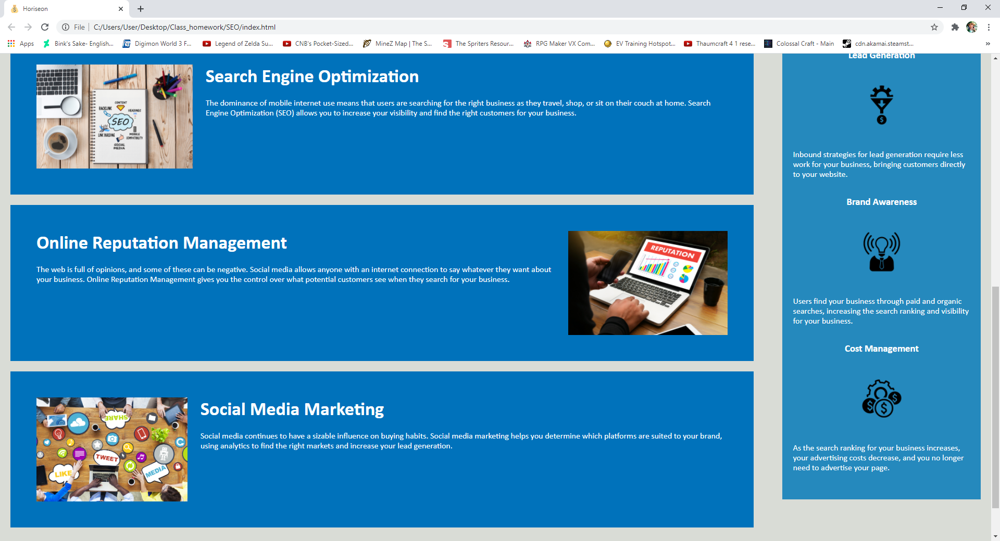

# Horiseon Marketing

## Description

Horiseon is a marketing company that focuses on search engine optimization, social media marketing, and online reputation management. The  objective of this project is to make the web page fully functional as well as a more pleasing CSS code.

## Usage

Use the links at the top of the page to quickly move down the page.

## Credits

Chad Cook [link to Github profile!](https://github.com/Chad1281)
Guide used for the readme file is [here](https://guides.github.com/features/mastering-markdown/)